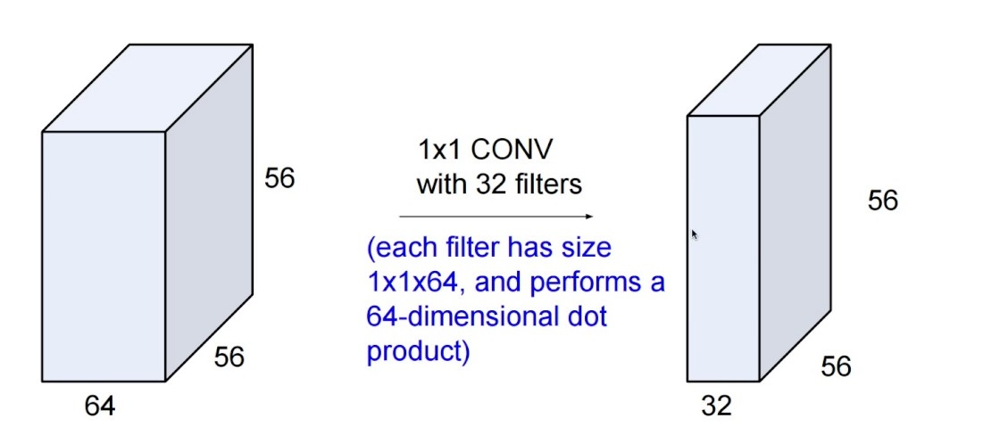
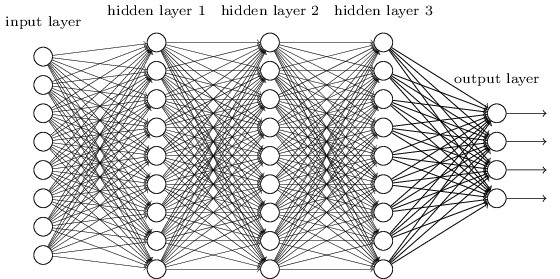
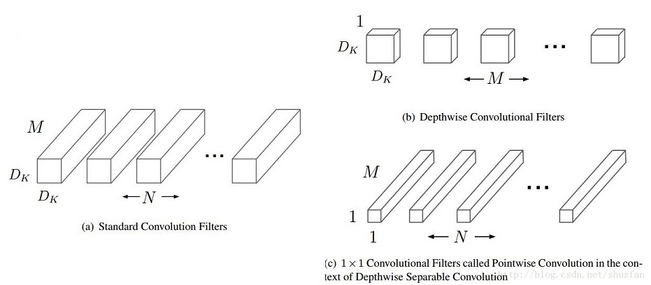
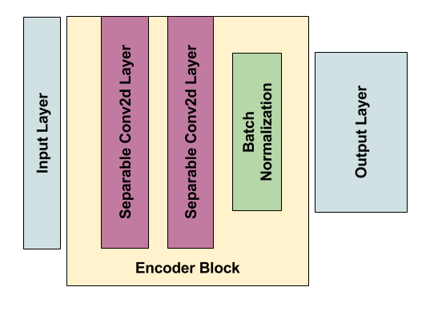
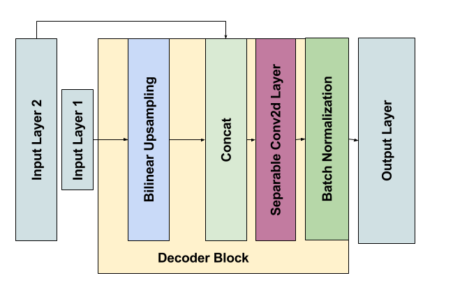
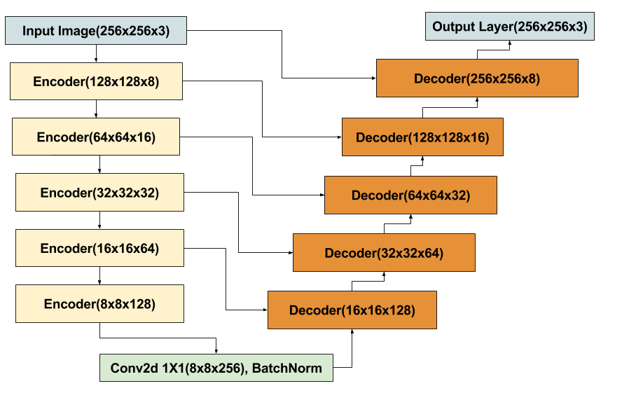
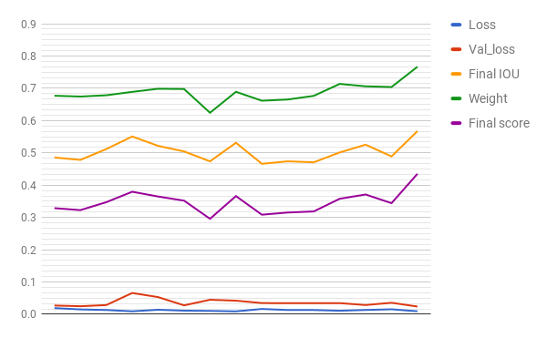

## Follow Me : Deep Learning Project
### Nitish Puri

In this project, we train a deep neural network to identify and track a target in simulation. So-called “follow me” applications like this are key to many fields of robotics and the very same techniques we apply here could be extended to scenarios like advanced cruise control in autonomous vehicles or human-robot collaboration in industry.

[image_0]: ./docs/misc/sim_screenshot.png
![alt text][image_0] 

### Setup instructions
*Setup instructions and repository locations can be found from the project Readme*

### Network architecture

The suggested network in the project is a Fully Convolutional Network(i.e. no dense/fully 
connected layers are present). Our network follows an Encoder/Decoder based architecture to 
support pixel level classification instead of image-level classification.   

First we discuss the various layer blocks used to build our network.

#### 1 X 1 Convolutions
    

1 X 1 Convolutions are essentially a *cheap* way of changing the depth/channel size of a tensor.
It is also used in the *inception* architecture before different sized convolution blocks to reduce the number of learnable parameters.     
There are different ways this layer can be interpreted.   

* It does not take into account the spatial patterns/features i.e. preserves the spatial information without activating upon any features.
* Instead it can be thought of as fitting to cross-channel correlation.
* Mathematically they can be interpreted as multilayer perceptrons, i.e. a linear transformation per filter.   

We use 1 X 1 convolutions in two places.   

* One, as a part of the *separable convolutions* as *pointwise convolution* discussed later.
* Second, in our middle layer as a way of increasing the *encoding* depth just before upsampling.

#### Fully connected layers
    

A fully connected layer basically means that every input(activation from the previous layer) 
is connected to every output through a weight. This is also known as a Dense layer. These layers are the basis of a general vanilla neural network.   
Our model does not use any fully connected layer, but they are generally used as final layers for a classification task when it might collect all the spatial information together just before answering the question.    

Ideally, a network composed of only fully connected layers(or even a network composed of a single hidden fully connected layer with enough hidden neurons) can perform the same transformations as performed by the different types of layers and architectures we use, however training them might be extremely difficult as we would have no control over the *kind* of learning our network is doing i.e. how much our network is able to generalize and if there is any redundancy in the weights or if it is able to learn hierarchical information.

#### Separable Convolutions
    

This technique is used for reducing the number of learnable parameters in the network, thus allowing us to build deeper networks, or help networks learn faster for a similar architecture.
These form the basis of the *xception* architecture.    

The way that works is by decoupling the *depthwise* and *spatial* information. More details can be found [here](https://medium.com/towards-data-science/types-of-convolutions-in-deep-learning-717013397f4d).

This is very helpful for deployment on mobile devices because of its efficient use of parameters.

#### Encoder Block
We use the previously discussed *separable convolution* layers in the encoder block.    
Every encoder block is composed of two *separable convolution* layers, each followed by a batch normalization layer. Here is the corresponding code.
```python
def encoder_block(input_layer, filters, strides):    

    # This layer preserves the input layer dimension by using a stride of 1.
    input_layer = SeparableConv2DKeras(filters=filters,kernel_size=3, strides=1,
                             padding='same', activation='relu')(input_layer)

    output_layer = separable_conv2d_batchnorm(input_layer=input_layer, filters=filters,                             strides=strides)        

    return output_layer
```

This block can be represented as,   
   

Using two conv layers per encoder block is purely based on intuition. This comes from the [*U-net* architecture](https://arxiv.org/abs/1505.04597) which uses *skip* layers and employs an encoder/decoder architecture for image segmentation.   

#### Bilinear Upsampling
This layer is used as a part of the Decoder block of the network to *Upsample* the decoded information from the previous block, so as to pass to a higher level decoder block.   

This is a simple interpolation operation on both spatial dimensions.   

#### Decoder Block
The decoder block takes in two inputs, one from the immediate previous layer and one from an earlier layer through skip connection. 
```python
def decoder_block(small_ip_layer, large_ip_layer, filters):

    # Upsample the input from previous layer    
    upsample_layer = bilinear_upsample(small_ip_layer)
    
    # Concat the upsampled layer with an earlier layer.
    concat_layer = layers.concatenate(inputs=[upsample_layer, large_ip_layer])
    
    # Convolution on the concatenated layer
    output_layer = separable_conv2d_batchnorm(input_layer=concat_layer, filters=filters)
        
    return output_layer
```   

   


#### FCN Architecture
As discussed earlier, we use an encoder/decoder architecture for doing pixel level classification. Here is the high level structure of the final network.    
   

I am using a 5 layer deep encoder and correspondingly 5 layer deep decoder network.
The following code shows how the network is built up along with corresponding layer dimensions with an input size (`image_hw`) of 256.   
```python
def fcn_model(inputs, num_classes):

    # input :: (?, 256, 256, 3)

    # Encoder layers        
    l1 = encoder_block(inputs, filters=8, strides=2)        #(?, 128, 128, 8)
    l2 = encoder_block(l1, filters=16, strides=2)           #(?, 64, 64, 16)
    l3 = encoder_block(l2, filters=32, strides=2)           #(?, 32, 32, 32)
    l3_2 = encoder_block(l3, filters=64, strides=2)         #(?, 16, 16, 64)
    l3_3 = encoder_block(l3_2, filters=128, strides=2)      #(?, 8, 8, 128)

    # 1X1 convolution
    l4 = conv2d_batchnorm(l3_3, filters=256, kernel_size=1) #(?, 8, 8, 256)
    
    # Decoder layers   
    l5_3 = decoder_block(l4, l3_2, filters=128)             #(?, 16, 16, 128)
    l5_2 = decoder_block(l5_3, l3, filters=64)              #(?, 32, 32, 64)
    l5 = decoder_block(l5_2, l2, filters=32)                #(?, 64, 64, 32)
    l6 = decoder_block(l5, l1, filters=16)                  #(?, 128, 128, 16)
    l7 = decoder_block(l6, inputs, filters=8)               #(?, 256, 256, 8)
    
    output_layer = layers.Conv2D(num_classes, 3, activation='softmax', padding='same')(l7)
        
    return output_layer                                     #(?, 256, 256, 3)
```   

With this setup, the final model parameter count turns out to be,   
```
Total params: 133,185
Trainable params: 131,681
Non-trainable params: 1,504
```

### Preprocessing and Data augmentation

As a preprocessing step, the boilerplate code already uses a normalized, zero mean input image using `preprocess_input` in `data_iterator.py`.   
There is already an auxillary method available for data augmentation(`shift_and_pad_augmentation`), however it is not being used.   

I added another function that randomly flips(horizontally) the input and mask image while preparing a batch. This method was added in `data_iterator.py`.   
```python
def random_flip(x, y):
    if np.random.random() < 0.5:     # Randomly flip the input half the time.
        x = np.fliplr(x)
        y = np.fliplr(y)

    return x, y
```

### Hyperparameter tuning

For training these are the various methods that I tried for tuning.   

* `learning_rate` from 0.01 to 0.0001.
    Also tried retraining the model after reducing the learning rate after 30 epochs. The final
    value that my model uses is **0.001**.
* Number of training epochs varying from 30 to 100.
    Different architectures and optimizers required different number of epochs to converge. 
* Tried different network architectures.
    I started with a *3* layer deep(i.e. 3 encoder blocks and 3 decoder blocks) network using a single seperable conv layer in the encoder block. Eventually, increased the network depth  to *4* and *5* using two seperable conv layers in the encoder.    
* Used `Nadam`(RMSProp with Nesterov Momentum) apart from `Adam` optimizer.
    * I did not find much of a difference for in the final losses for the two optimizers, and decided to use `Adam` for my final run.   
* Collect and process data from the sim and augment it with the provided training data.
    I started training with the data that was shared initially, after that I tried to capture some data from the sim, but I had to hand pick images from it there was a lot of redundancy. This turned out to be very time consuming. Finally, the new training data helped in achieving the required score without any need for custom collected data.
* Changed the input image resolution from *160* to *256*.
* Used `ModelCheckpoint` to save intermediate weights and tried using the weights with least 
`val_loss`.
    This however did not help at all, almost always the score was much better when I used the weights from the last epoch, instead of using a `best` model from all the intermediate epochs.

Other configurable parameters,
* I use a `batch_size` of 32, limited by my video memory.
* And, the `steps_per_epoch` are defined by the input size and batch size, i.e. `steps_per_epoch = no_input_data/batch_size`. So, In my case, while using the new test data, I had *4131* input images, and I use augment the input data by horizontal flipping.     
`steps_per_epoch = 4131*2/32 = 258`    
So, I use a rounded value of *250*.    


The results from my various attempts are summarized below.   
The `Description` column specifies the change made in the architecture or data source from the previous run.    

| Description                                                             | Learning rate | Epochs | Loss   | Val_loss | Final IOU | Weight | Final score |
|-------------------------------------------------------------------------|---------------|--------|--------|----------|-----------|--------|-------------|
| 3 blocks/1 conv layer encoder/ original training data/ image size = 160 | 1.00E-02      | 30     | 0.0193 | 0.0272   | 0.4858    | 0.6771 | 0.3289      |
| 4 encoder blocks/ ---                                                   | 1.00E-02      | 20     | 0.0152 | 0.0251   | 0.4784    | 0.6746 | 0.3228      |
| ---                                                                     | 1e-3/1e-4     | 20/5   | 0.0134 | 0.0287   | 0.5119    | 0.6786 | 0.3474      |
| ---                                                                     | 1.00E-03      | 60     | 0.0093 | 0.0661   | 0.5509    | 0.6891 | 0.3797      |
| 5 encoder blocks                                                        | 5.00E-03      | 20     | 0.0142 | 0.0533   | 0.5218    | 0.6987 | 0.3649      |
| ---                                                                     | 8.00E-03      | 20     | 0.0114 | 0.0278   | 0.5046    | 0.6979 | 0.3521      |
| 2 conv layer encoder with custom data                                   | 8.00E-03      | 80     | 0.0106 | 0.0451   | 0.4739    | 0.6244 | 0.2959      |
| Using Nadam optimizer with custom data                                  | 1.00E-03      | 100    | 0.0091 | 0.0423   | 0.5314    | 0.6893 | 0.3663      |
| Using Adam on the same architecture, using new data                     | 1.00E-03      | 60     | 0.0166 | 0.0349   | 0.4663    | 0.6617 | 0.3086      |
| 1 Layer encoder                                                         | 1.00E-04      | 60     | 0.0134 | 0.0345   | 0.474     | 0.6655 | 0.3154      |
| 2 layer encoder                                                         | 2.00E-03      | 30     | 0.0133 | 0.0346   | 0.4709    | 0.6767 | 0.3187      |
| 1 layer encoder, 1 extra conv layer at the start                        |               | 60     | 0.0111 | 0.0347   | 0.5014    | 0.7137 | 0.3579      |
| Nadam optimizer                                                         |               | 100    | 0.0135 | 0.0288   | 0.5255    | 0.7064 | 0.3712      |
| Adam optimizer                                                          | 1.00E-04      | 100    | 0.0156 | 0.0358   | 0.4891    | 0.7041 | 0.3443      |
| 5 blocks/2 layer encoder, image size = 256                              | 1.00E-03      | 50     | 0.0094 | 0.0241   | 0.5676    | 0.7669 | 0.4353      |     


The following chart plots the above table, with horizontal axis specifying the different attempts and vertical axis showing the labeled metric.     
     


Finally, the learning curve for the last trained network is shown,    
     

The final model is saved as `data/weights/final_model.h5` and the corresponding config file, `data/weights/config_final_model`.    

With the above model, the quad can now successfully `follow` the target.   
[Here is the video in action](https://youtu.be/5CEIWJvnxw8)

### Limitations and potential improvements

* The current implementation is based on the masks provided by the sim, where the target identification and differentiation from the crowd is already done and supplied to the model in the form of a mask. This might not be possible to do in general, and this would also not allow to identify a general target.
* We can devise a method where the model can do instance segmentation and identify all the possible targets in the current frame and label them. After this the quad can choose to follow the closest general target, or use some other heuristic to identify which target to follow.
* In the above scenario we would also need to make sure that there is some correlation in between the predictions of two consecutive frames, so that for example, a target would retain its label as long as it is in the view. This can be done using recurrent networks.
* Also, we can do away with the input masks and use methods like *Mask R-CNN* or *SSD* with *VGG* as our base network. This would allow the network to automatically generate the masks or bounding boxes for all the different entity instances present in the frame. And, allowing this architecture to memorize by adding *recurrent connections* can help in real time object tracking.
